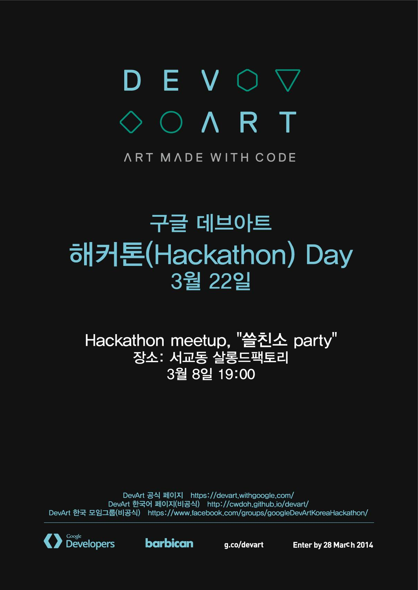

# Hackathon?

본래 해커톤(Hackathon)은 해킹(Hacking)+마라톤(Marathon)의 합성어로 개발자나 기획자, 디자이너 등 다양한 사람들이 한 팀을 이루어 창조적인 아이디어를 구현하는 아이디어 개발 대회입니다. 해커톤은 전세계에서 다양한 주제로 다양한 사람들이 참여하는 새로운 방식의 축제입니다. DevArt 해커톤은 DevArt의 취지에 맞게 개발자와 기획자, 디자이너, 예술가 등의 다양한 사람들이 모여 디지털 아트를 주제로 진행되는 해커톤 행사입니다.

## 3월 8일, DevArt Hackerthon 시작 알림과 쓸친소 Party 후기

DevArt Korea Hackathon의 Kickoff Meetup이 지난 3월 8일 토요일 홍대 Salon de factory에서 Google DevArt Hackerthon의 시작을 알리는 '쓸친소 Party'가 열렸습니다.

DevArt 및 해커톤 참여 방법으로 시작하여 참가자들간의 네트워킹을 위한 쓸친소 파티까지 진행을 하였는데 앞으로 2주 동안 DevArt Hackerthon을 어떻게 준비 사항들을 알아보시기 위해 개발자, 미디어 아티스트, 개(발자)디자이너, 공연기획 디렉터 등 정말 다양한 분들께서 참여해 주셨습니다. 무려 4시간동안 쉴 새 없이 자신의 관심 분야를 소개하고 아이디어를 나누었는데요, 열기가 대단했습니다!! 다들 적극적으로 대화와 토론에 참여하시는 모습을 보며 뿌듯함과 함께 기술과 예술의 거리가 생각보다 훨씬 더 가까운 곳에 있다는 느낌을 받을 수 있었습니다 .DevArt 참가계획이 없으셨던 분도 주변의 응원에 힘입어 참가하기로 마음을 바꾸셨다는 훈훈한 이야기도 있어요. :)

3월 22일 열리는 <Google DevArt Hackerthon Fest>에서는 더욱 많은 분들을 뵙고 싶습니다. :-D
킥오프 밋업에 참가하지 못하신 분들도 22일 해커톤 Fest에 자유롭게 참여하실 수 있으니 앞으로도 [DevArt Hackerthon 페이스북](https://www.facebook.com/groups/googleDevArtKoreaHackathon/)과 [비공식 사이트](https://cwdoh.github.io/devart/)를 자주 방문해 주시기 바랍니다.

---

## 3월 8일(토) - DevArt 해커톤 킥오프 밋업 관련 공지

3월 8일 토요일, 홍대에서 넘치는 상상력을 보여주실 DevArt Hackathon 참가 희망자를 모집합니다. 킥오프 밋업은 DevArt Hackathon에 대한 소개와 함께 참가할 파트너를 구하지 못해 "쓸쓸한" 분들을 위해 열리는 행사입니다. 관심이 있으시다면 참가하시고 창작욕을 함께 불태울 파트너를 찾아보세요! 참가 신청은 페이지 위쪽에 있습니다. :)

  

## 킥오프 밋업 진행 스케쥴

| 세션 시간 | 세션 |
|---|---|
| 19:00 ~ 19:10 | 접수 확인 및 안내 |
| 19:10 ~ 19:30 | 행사 소개 및 오거나이저 소개 |
| 19:30 ~ 20:30 | DevArt 참여 방법 소개 및 예제 프로젝트 소개 - [Chang W. Doh](http://html5rocksko.blogspot.com) |
| 20:30 ~  | 참여자 프리토킹 및 "쓸친소party" |

## 위치 - [홍대 살롱 드 팩토리(Salon de factory)](https://www.facebook.com/SalonDeFactory)

지하철을 이용하여 오시는 경우 2호선 합정역(3번 출구), 홍대입구역(9번 출구), 6호선 상수역(1번 출구)를 이용하시면 됩니다. 자세한 위치는 아래 지도나 [구글 지도](https://goo.gl/maps/n0WuB), [네이버 지도](http://map.naver.com/local/siteview.nhn?code=19886105), [다음 지도](http://place.map.daum.net/8106600)에서 확인하시기 바랍니다.

<iframe src="https://www.google.com/maps/embed?pb=!1m14!1m8!1m3!1d395.39574479494655!2d126.9218593!3d37.55115359999999!3m2!1i1024!2i768!4f13.1!3m3!1m2!1s0x357c98dacacac473%3A0x71e86b1715c1dd36!2z7IK066Gx65Oc7Yyp7Yag66as!5e0!3m2!1sko!2skr!4v1394080769546" width="320" height="240" frameborder="0" style="border:0"></iframe>

## 기타

* 안타깝게도 DevArt 참여 규칙 및 진행 여건에 의해 미성년자는 킥오프 밋업에 참여하실 수 없습니다. :(
* 참가자에게는 파티 중 마실 수 있는 1병의 맥주가 제공됩니다. (추가적인 음료는 개인이 직접 구매하여 드실 수 있습니다.)

---

  <em>이 행사는 의 후원을 받고 자원봉사자들의 도움을 통해 진행되는 행사입니다.</em>

